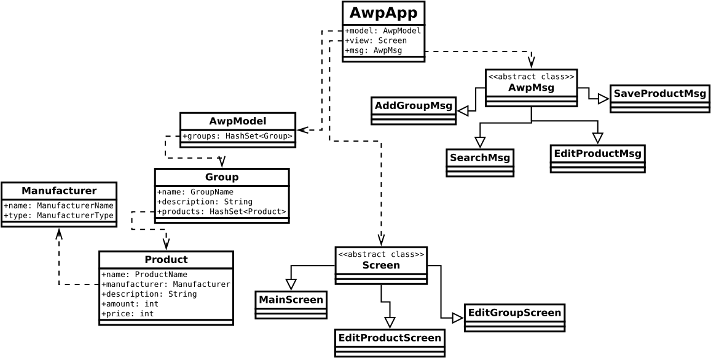

# AWP Project Overview

The Automated Workplace (**AWP**) project is a Java application designed to streamline and automate various tasks related to workplace management. It encompasses functionalities for managing products, groups, manufacturers, and search operations. The project follows a modular architecture, with distinct packages for different layers of the application, including views, screens, models, and messages.

## Package Structure:

* **awp.view**:
    * **AwpApp**: Main entry point for the AWP application.
    * **widgets**: Package containing custom UI widgets used throughout the application.
        * **DisplayProducts**: Widget for displaying products.
        * **SearchBar**: Widget for search functionality.
        * **Card**: Custom card component.
        * **Icon**: Icon component.
        * **DisplayGroup**: Widget for displaying groups.
        * **MainMenu**: Main menu component.
        * **LabeledTextArea, LabeledTextField**: Components for labeled text input.
        * **DisplayItem**: Widget for displaying individual items.
        * **AddGroup**: Widget for adding groups.

* **awp.view.screens**:
    * **Screen**: Base class for all screens in the application.
    * **EditProductScreen**: Screen for editing product details.
    * **MainScreen**: Main screen of the application.
    * **EditGroupScreen**: Screen for editing group details.

* **awp.model**:
    * **AwpModel**: Main model class managing data and business logic.
    * **Group, Manufacturer, Product**: Model classes representing entities in the application domain.
    * **GroupName, ManufacturerName, ProductName**: Wrapper classes for names of entities.
    * **search**: Package containing classes related to search functionality.
        * **SearchPattern**: Class representing search patterns.

* **awp.model.error**:
    Classes representing various error conditions and exceptions that can occur during model processing.
        **InvalidProductNameException, InvalidGroupNameException, InvalidSearchPromptException, ModelProcessingException, InvalidManufacturerNameException, NoSuchGroupException**.

* **awp.msg**:
    Classes representing different types of messages used for communication within the application.
    **SaveGroupMsg, DeleteProductMsg, NewGroupMsg, OpenProductMsg, AwpMsg, AddProductMsg, SearchMsg, DeleteGroupMsg, AddGroupMsg, EmptyMsg, SaveProductMsg, EditGroupMsg, EditProductMsg, OpenGroupMsg**.       