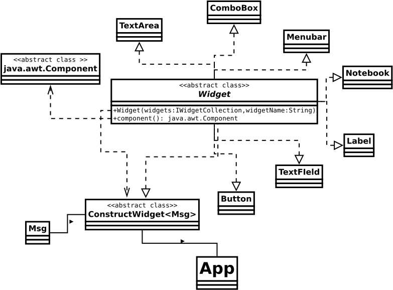

# Swelm UI Framework Overview:

The Swelm UI framework is a Java-based framework built on top of Swing. It aims to provide developers with a comprehensive set of tools and components for creating declarative user interfaces for Automated Workplace (AWP) projects. The framework follows a modular structure, with distinct packages for different types of components and utilities.

## Package Structure

* swelm.app:
    * **App**: Main entry point for Swelm applications.
    * **Window**: Class for managing application windows.
    * **Splashcreen**: Implementation of a splash screen for application startup.
    * **IWidgetCollection**: Interface for managing collections of widgets.
    * **Widgets**: Utility class for working with widgets.

* swelm.widgets:
    * **Widget**: Base class for all UI widgets.
    * **Tab**: Implementation of a tabbed pane.
    * **ScrollablePanel**: Panel with scrollbars for displaying large content.
    * **TextField**: Text input field.
    * **HTMLLabel**: Label component for displaying HTML content.
    * **Button**: Implementation of a clickable button.
    * **Image**: Component for displaying images.
    * **Notebook**: Container for organizing multiple panels in a notebook-like interface.
    * **TextArea**: Multiline text input field.
    * **ConstructWidget**: Interface for constructing widgets dynamically.
    * **TextPane**: Component for displaying styled text.

* swelm.widgets.menu:
    * **Menu**: Implementation of a menu component.
    * **MenuItem**: Menu item component.
    * **SingleItem**: Interface for single menu items.
    * **MenuBar**: Menu bar component for organizing menus.

* swelm.widgets.containers:
    * **CoreWidget**: Base class for container widgets.
    * **BorderContainer**: Container with border layout.
    * **Glue**: Utility class for adding flexible space.
    * **GridContainer**: Container with grid layout.
    * **BoxContainer**: Container with box layout.
    * **WrapContainer**: Container with wrap layout.

* swelm.widgets.swing:
    * **RoundedBorder**: Implementation of a rounded border for Swing components.
    * **HTMLJLabel**: JLabel component for displaying HTML content.
    * **JPlaceholderTextField**: Text field component with placeholder text support.
    * **WrapLayout**: Layout manager for wrapping components.
    * **JPlaceholderTextArea**: Text area component with placeholder text support.
    * **TruncatingTextPane**: Text pane component with truncation support.

* swelm.widgets.ui:
    * **SwelmTextFieldUI**: UI delegate for customizing text field appearance.
    * **SwelmTextAreaUI**: UI delegate for customizing text area appearance.
    * **SwelmTabbedPaneUI**: UI delegate for customizing tabbed pane appearance.

* swelm.utils:
    * **ResourceImage**: Utility class for working with image resources.
    * **Pos.java, Color.java, Size**: Utility classes for positioning, color, and size manipulation.
    * **DumpMode.java, UnitMsg.java, MsgBox**: Utility classes for debugging and messaging.
    * **AdjustableWidget**: Interface for adjustable widgets.