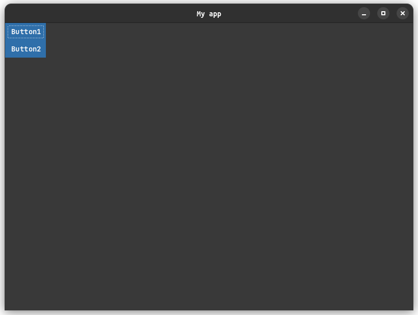

# Creating app

In swelm every application is a widget, which is constructed from other atomic 
or complex widgets. To create an application create a class, which extends `ConstructWidget`:

```java
public class MyApp extends ConstructWidget<MyMsg> {
    
    @Override
    public void init() {
        // Initialization
    }

    @Override
    public void event(MyMsg msg) {
        // Event processing
    }

    @Override
    public Widget build() {
        // Building out application
    }

}
```

Now let's figure out every component of our application:

 * `MyMsg` is our custom class of message, which is a component generated by 
    our application in response to the user's interaction. It is process in 
    `event` method. Messages can be of any type, but we'll talk about it more 
    precisely in chapter [Events](./events.md)
 * `init` method is executed once after building the application to setup and
    manipulate application widgets at the beginning. Read more about it in
    [Accessing widgets](./accessing-widgets.md) chapter.
 * `build` method is where our application view arises. There we place our widgets
    in a structure we want it to be shown. Such an approach is called 
    [Declarative programming](https://en.wikipedia.org/wiki/Declarative_programming)

Let's add [`CoreWidget`](../widgets/core-widget.md) to our build method. In a 
constructor we pass our application instance (we can also pass other collection
which implements `IWidgetCollection` interface, but it is not recomended; read
more about it in [Accessing widgets](./accessing-widgets.md) chapter), 
unique ID (which is usually its underscored name) and an inner widget, whichin 
most cases is a container, where other widgets will be stored:

```java
@Override
public Widget build() {
    return new CoreWidget(this, "my_app",
        // inner widget
    );
}
```

Add a [`BoxContainer`](../widgets/containers/box-container.md) widgets which will 
represent our application main layout:

```java
@Override
public Widget build() {
    return new CoreWidget(this, "my_app",
        new BoxContainer(this, "my_box")
    );
}
```

Now it is empty. Let's add some widgets to it, using its `children` parameter. All 
widgets in Swelm are constructed autonomously and their parameters are accessed with methods:

```java
@Override
public Widget build() {
    return new CoreWidget(this, "my_app",

        new BoxContainer(this, "my_box")
            .children(new Widget[]{
                // Our main widgets
            })

    );
}
```

Now add two buttons with labels "Button1" and "Button2" to our box. We are doing it 
the same way, using `text` parameter:

```java
@Override
public Widget build() {
    return new CoreWidget(this, "my_app",

        new BoxContainer(this, "my_box")
            .children(new Widget[]{
                new Button(this, "button1")
                    .text("Button1"),

                new Button(this, "button2")
                    .text("Button2")
            })

    );
}
```

Also let's say we want our box to be aligned vertically. The same way we use
`align` parameter to our `BoxContainer`:

```java
@Override
public Widget build() {
    return new CoreWidget(this, "my_app",

        new BoxContainer(this, "my_box")
            .align(BoxAlign.Vertical)
            .children(new Widget[]{

                new Button(this, "button1")
                    .text("Button1"),

                new Button(this, "button2")
                    .text("Button2")

            })

    );
}
```

Congratulations! You've just created your first swelm application. But how to run it?
For this purpose we'll use [`App`](../utilities/app.md) class:

```java
public static void main(String[] args) {
    new App<MyMsg>(new MyApp())
        .run();
}
```

So for now our application looks like this:

